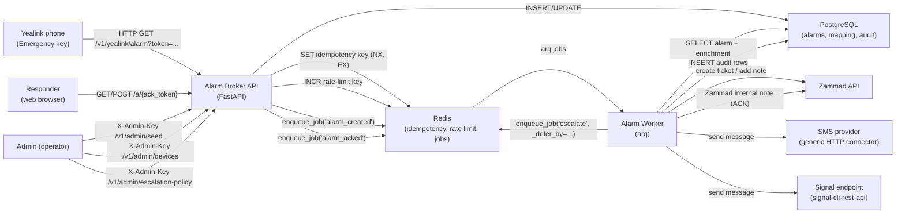
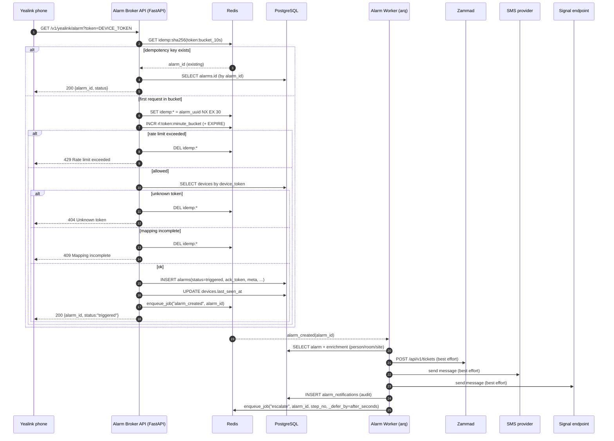
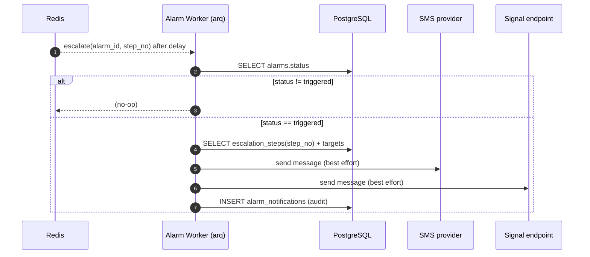
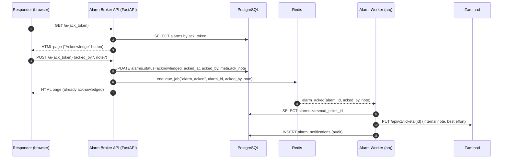
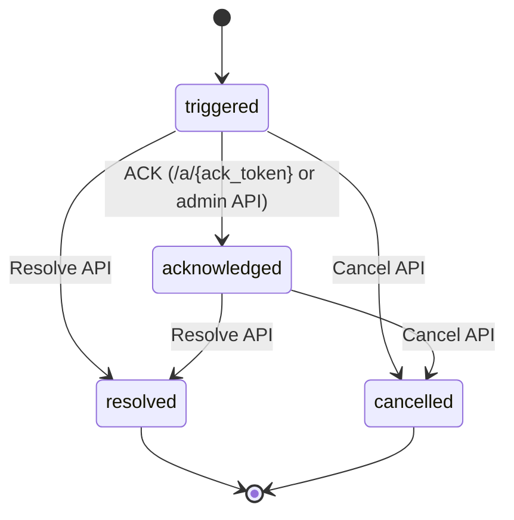

# alarm-broker (MVP / Proof of Concept)

## DISCLAIMER (PLEASE READ)

This project is **work in progress** and currently **not a production-ready alarm broker**.

- **Do not use this repository “as-is” in safety-critical, security-critical, or compliance-critical environments.**
- **Do not rely on it for emergency response, duress alarms, personal safety, or life safety use cases.**
- It is an **open-source proof of concept** intended to explore a reference architecture, integration patterns, and an MVP workflow.
- No warranty is provided; you are responsible for risk assessment, hardening, monitoring, redundancy, and operational procedures.

## What this is

An Alarm Broker MVP that receives a silent/panic alarm trigger (e.g. Yealink emergency key) and fans out notifications to:

- Zammad (create/update ticket)
- SMS (generic HTTP connector placeholder)
- Signal (expects a signal-cli-rest-api compatible endpoint)

It supports:
- Persisting alarms in PostgreSQL (with audit logs)
- An ACK (acknowledge) capability link (`/a/{ack_token}`)
- A simple escalation schedule via Redis-backed jobs
- Prometheus-style metrics (`/metrics`)
- A read-only admin dashboard (`/admin?key=<ADMIN_API_KEY>`)

## Flow diagrams (Mermaid)

The diagrams below reflect the flow as implemented in this repository.

### 1) System overview (runtime components)



### 2) Trigger flow (Yealink → API → DB → worker)



### 3) Escalation loop (delayed jobs)



### 4) ACK flow (capability link)



### 5) Alarm lifecycle (current implementation)



## Repository layout

- `docs/` – concepts and specifications (English)
- `services/alarm_broker/` – FastAPI API + arq worker + Alembic migrations
- `deploy/` – Docker Compose + example seed file

Main docs:
- `docs/ARCHITECTURE.md`
- `docs/DATA_MODEL.md`
- `docs/INTEGRATIONS.md`
- `docs/archive/DEEP_CODE_INSPECTION_FINDINGS.md`

## Requirements

- Docker Desktop
- Python 3.12+ (optional for local dev; Docker is enough to run)

## Quickstart (Docker, local)

1) Create `.env`:

```bash
cp .env.example .env
```

2) Start services:

```bash
docker compose -f deploy/docker-compose.yml up -d --build
```

3) Run DB migrations:

```bash
docker compose -f deploy/docker-compose.yml exec api alembic upgrade head
```

4) Load seeds (example):

```bash
curl -sS -X POST "http://localhost:8080/v1/admin/seed" \
  -H "X-Admin-Key: change-me-admin-key" \
  -H "Content-Type: application/x-yaml" \
  --data-binary @deploy/seed.example.yaml
```

5) Smoke test (Yealink trigger):

```bash
curl -sS "http://localhost:8080/v1/yealink/alarm?token=YLK_T54W_3F9A" | jq .
```

The response contains `alarm_id`. Fetch the alarm details (admin key required) to get `ack_token`:

```bash
curl -sS "http://localhost:8080/v1/alarms/<alarm_id>" -H "X-Admin-Key: change-me-admin-key" | jq .
```

Then open the ACK page:

```bash
open "http://localhost:8080/a/<ack_token>"
```

Readiness check:

```bash
curl -sS "http://localhost:8080/readyz" | jq .
```

## Configuration

See `.env.example` for available variables (Zammad, SMS, Signal, escalation).

Notes:
- The SMS connector is intentionally generic and expects an HTTP endpoint (see `SENDXMS_*` variables).
- Signal expects a `signal-cli-rest-api` compatible endpoint.

## Developer workflow (local)

```bash
make lint
make test
make audit
```
