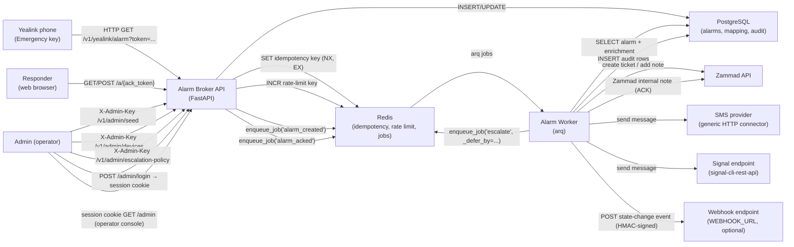
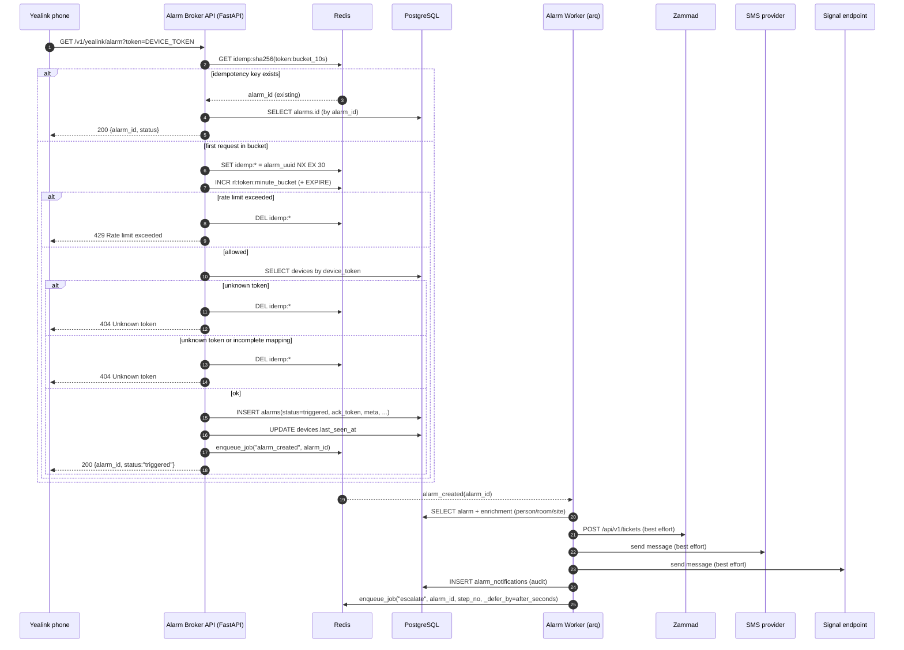
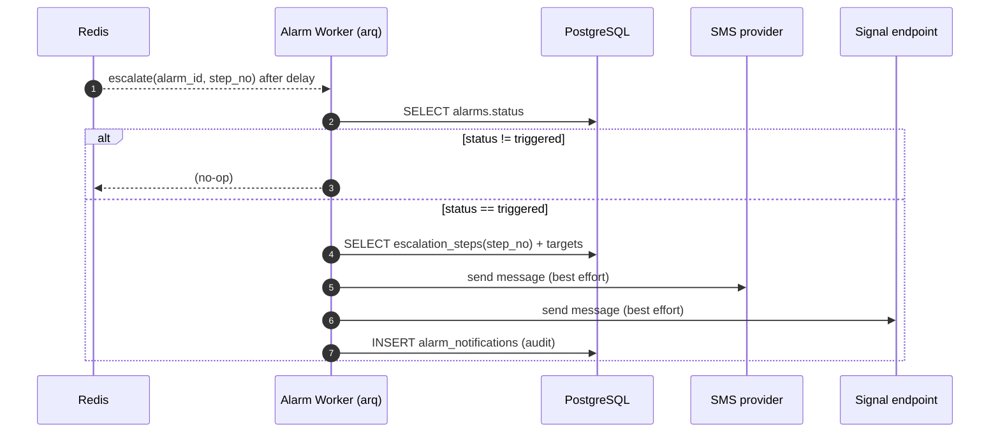
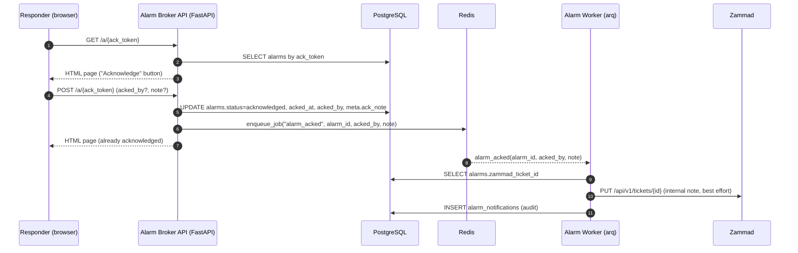
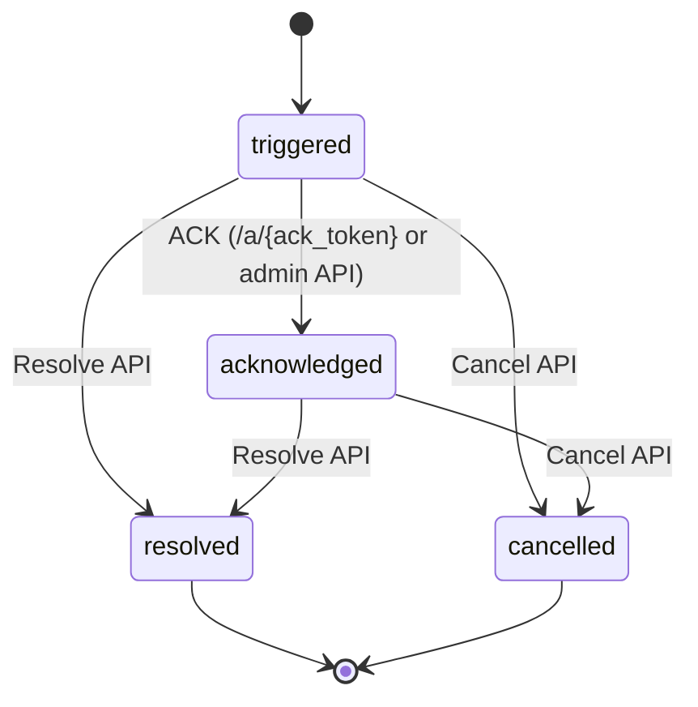

# alarm-broker (Release Candidate)

[](https://github.com/sebastianspicker/alarm-broker/actions/workflows/ci.yml)

> **NOTICE (Release Candidate)** -- This project is a **release candidate** and not yet validated for safety-critical, security-critical, or compliance-critical environments.
> It is an open-source reference implementation for alarm intake, persistence, acknowledgement, notification fan-out, and escalation workflows.
> No warranty is provided; you are responsible for risk assessment, hardening, monitoring, redundancy, and operational procedures before any production deployment.

## Features

- **Silent/panic alarm trigger** -- Receives HTTP triggers from Yealink emergency keys (or any HTTP client)
- **Multi-channel fan-out** -- Notifies via Zammad (ticketing), SMS (generic HTTP connector), and Signal (signal-cli-rest-api)
- **Capability-link ACK** -- Responders acknowledge alarms via a mobile-friendly `/a/{ack_token}` page (no login required)
- **Escalation engine** -- Configurable escalation schedule with delayed Redis-backed jobs
- **Bilingual operator console** -- Filtered alarm worklist, deep-linkable details, safe lifecycle actions, configuration, system state, and activity (`/admin`)
- **Full audit trail** -- Every alarm state change and notification is persisted in PostgreSQL
- **Prometheus metrics** -- Admin-protected `/metrics` endpoint for monitoring and alerting
- **Idempotency & rate limiting** -- Deduplicates rapid triggers; prevents abuse
- **Simulation mode** -- Demo mode with mock connectors for testing without live integrations

## Flow diagrams (Mermaid)

The diagrams below reflect the flow as implemented in this repository.

### 1) System overview (runtime components)


```mermaid
flowchart LR
  %% External trigger/source
  Y["Yealink phone<br/>(Emergency key)"] -->|"HTTP GET /v1/yealink/alarm?token=..."| API["Alarm Broker API<br/>(FastAPI)"]

  %% Core state & job infrastructure
  API -->|"INSERT/UPDATE"| PG["PostgreSQL<br/>(alarms, mapping, audit)"]
  API -->|"SET idempotency key (NX, EX)"| R["Redis<br/>(idempotency, rate limit, jobs)"]
  API -->|"INCR rate-limit key"| R
  API -->|"enqueue_job('alarm_created')"| R

  %% Worker fan-out & escalation
  R -->|"arq jobs"| W["Alarm Worker<br/>(arq)"]
  W -->|"SELECT alarm + enrichment"| PG
  W -->|"INSERT audit rows"| PG
  W -->|"enqueue_job('escalate', _defer_by=...)"| R

  %% Downstream connectors (best effort)
  W -->|"create ticket / add note"| Z["Zammad API"]
  W -->|"send message"| SMS["SMS provider<br/>(generic HTTP connector)"]
  W -->|"send message"| SIG["Signal endpoint<br/>(signal-cli-rest-api)"]
  W -->|"POST state-change event (HMAC-signed)"| WH["Webhook endpoint<br/>(WEBHOOK_URL, optional)"]

  %% Responder acknowledgement flow
  RESP["Responder<br/>(web browser)"] -->|"GET/POST /a/{ack_token}"| API
  API -->|"enqueue_job('alarm_acked')"| R
  W -->|"Zammad internal note (ACK)"| Z

  %% Admin flow (seeding/mapping + operator console)
  ADMIN["Admin (operator)"] -->|"X-Admin-Key /v1/admin/seed"| API
  ADMIN -->|"X-Admin-Key /v1/admin/devices"| API
  ADMIN -->|"X-Admin-Key /v1/admin/escalation-policy"| API
  ADMIN -->|"POST /admin/login → session cookie"| API
  ADMIN -->|"session cookie GET /admin (operator console)"| API
```

### 2) Trigger flow (Yealink → API → DB → worker)


```mermaid
sequenceDiagram
  autonumber
  participant Y as Yealink phone
  participant API as Alarm Broker API (FastAPI)
  participant R as Redis
  participant PG as PostgreSQL
  participant W as Alarm Worker (arq)
  participant Z as Zammad
  participant SMS as SMS provider
  participant SIG as Signal endpoint

  Y->>API: GET /v1/yealink/alarm?token=DEVICE_TOKEN
  API->>R: GET idemp:sha256(token:bucket_10s)
  alt idempotency key exists
    R-->>API: alarm_id (existing)
    API->>PG: SELECT alarms.id (by alarm_id)
    API-->>Y: 200 {alarm_id, status}
  else first request in bucket
    API->>R: SET idemp:* = alarm_uuid NX EX 30
    API->>R: INCR rl:token:minute_bucket (+ EXPIRE)
    alt rate limit exceeded
      API->>R: DEL idemp:*
      API-->>Y: 429 Rate limit exceeded
    else allowed
      API->>PG: SELECT devices by device_token
      alt unknown token
        API->>R: DEL idemp:*
        API-->>Y: 404 Unknown token
      else unknown token or incomplete mapping
        API->>R: DEL idemp:*
        API-->>Y: 404 Unknown token
      else ok
        API->>PG: INSERT alarms(status=triggered, ack_token, meta, ...)
        API->>PG: UPDATE devices.last_seen_at
        API->>R: enqueue_job("alarm_created", alarm_id)
        API-->>Y: 200 {alarm_id, status:"triggered"}
      end
    end
  end

  %% async fan-out
  R-->>W: alarm_created(alarm_id)
  W->>PG: SELECT alarm + enrichment (person/room/site)
  W->>Z: POST /api/v1/tickets (best effort)
  W->>SMS: send message (best effort)
  W->>SIG: send message (best effort)
  W->>PG: INSERT alarm_notifications (audit)
  W->>R: enqueue_job("escalate", alarm_id, step_no, _defer_by=after_seconds)
```

### 3) Escalation loop (delayed jobs)


```mermaid
sequenceDiagram
  autonumber
  participant R as Redis
  participant W as Alarm Worker (arq)
  participant PG as PostgreSQL
  participant SMS as SMS provider
  participant SIG as Signal endpoint

  R-->>W: escalate(alarm_id, step_no) after delay
  W->>PG: SELECT alarms.status
  alt status != triggered
    W-->>R: (no-op)
  else status == triggered
    W->>PG: SELECT escalation_steps(step_no) + targets
    W->>SMS: send message (best effort)
    W->>SIG: send message (best effort)
    W->>PG: INSERT alarm_notifications (audit)
  end
```

### 4) ACK flow (capability link)


```mermaid
sequenceDiagram
  autonumber
  participant U as Responder (browser)
  participant API as Alarm Broker API (FastAPI)
  participant PG as PostgreSQL
  participant R as Redis
  participant W as Alarm Worker (arq)
  participant Z as Zammad

  U->>API: GET /a/{ack_token}
  API->>PG: SELECT alarms by ack_token
  API-->>U: HTML page ("Acknowledge" button)

  U->>API: POST /a/{ack_token} (acked_by?, note?)
  API->>PG: UPDATE alarms.status=acknowledged, acked_at, acked_by, meta.ack_note
  API->>R: enqueue_job("alarm_acked", alarm_id, acked_by, note)
  API-->>U: HTML page (already acknowledged)

  R-->>W: alarm_acked(alarm_id, acked_by, note)
  W->>PG: SELECT alarms.zammad_ticket_id
  W->>Z: PUT /api/v1/tickets/{id} (internal note, best effort)
  W->>PG: INSERT alarm_notifications (audit)
```

### 5) Alarm lifecycle (current implementation)


```mermaid
stateDiagram-v2
  [*] --> triggered
  triggered --> acknowledged: ACK (/a/{ack_token} or admin API)
  triggered --> resolved: Resolve API
  triggered --> cancelled: Cancel API
  acknowledged --> resolved: Resolve API
  acknowledged --> cancelled: Cancel API
  resolved --> [*]
  cancelled --> [*]
```

## Repository layout

- `docs/` – current public setup, operations, architecture, integration, and roadmap documentation
- `services/alarm_broker/` – FastAPI API + arq worker + Alembic migrations
- `deploy/` – Docker Compose + example seed file
- `PRODUCT.md` and `DESIGN.md` – product intent and browser-interface conventions

Current docs:
- [docs/SETUP.md](docs/SETUP.md) — installation, configuration reference, dev workflow
- [docs/OPERATIONS.md](docs/OPERATIONS.md) — monitoring, backups, troubleshooting
- [docs/ARCHITECTURE.md](docs/ARCHITECTURE.md) — data model, flows, lifecycle
- [docs/INTEGRATIONS.md](docs/INTEGRATIONS.md) — Yealink/Zammad templates and connector notes
- [docs/FRONTEND.md](docs/FRONTEND.md) — browser architecture and release checks
- [docs/ROADMAP.md](docs/ROADMAP.md) — active release-candidate backlog

## How to read the code

Start with the vertical trigger path, then branch out:

- `services/alarm_broker/alarm_broker/api/main.py` builds the FastAPI app, middleware, exception mapping, database engine, Redis pool, and route registration.
- `api/routes/yealink.py` is the inbound alarm endpoint. It resolves the client IP, checks the Yealink allowlist, extracts the configured token query parameter, and delegates to `TriggerService`.
- `services/trigger_service.py` owns trigger idempotency, rate limiting, device mapping checks, alarm persistence, and recovery metadata for downstream event publication.
- `services/event_publisher.py` is the ARQ job wire contract. It enqueues `process_alarm_event` jobs with deterministic IDs so duplicate created/state events collapse at the queue layer.
- `worker/tasks.py` is the background side of the flow: ticket creation, stage 0 notification fan-out, delayed escalation, ACK follow-up notes, state-change webhooks, and event-recovery scans.
- `services/notification_service.py` converts an enriched alarm into channel payloads and audit rows for Zammad, SMS, Signal, and escalation-target webhooks.
- `api/routes/ack.py` implements the bilingual capability-link ACK page. Possession of `ack_token` authorizes the ACK action, with CSRF and per-IP rate limiting around the browser form. See [`docs/FRONTEND.md`](docs/FRONTEND.md) for the browser architecture and release checks.

The core state transition rules live in `services/alarm_service.py`; the SQLAlchemy schema lives in `db/models.py`; shared request/response shapes live in `api/schemas.py`.

## Additional Resources

- `SECURITY.md` - Security policy and best practices
- `CHANGELOG.md` - Version history

## Requirements

- Docker Desktop
- Python 3.12+ (optional for local dev; Docker is enough to run)
- `jq` (optional, used by the example `curl` commands)

## Quickstart

```bash
# 1. Configure environment
cp .env.example .env
# Set ADMIN_API_KEY and YEALINK_DEVICE_TOKEN in .env before loading seed data.

# 2. Start all services (API + PostgreSQL + Redis + Worker)
docker compose -f deploy/docker-compose.yml up -d --build

# 3. Run database migrations
docker compose -f deploy/docker-compose.yml exec api alembic upgrade head

# 4. Load example seed data (devices, persons, rooms, escalation policy)
curl -sS -X POST "http://localhost:8080/v1/admin/seed" \
  -H "X-Admin-Key: <admin-api-key>" \
  -H "Content-Type: application/x-yaml" \
  --data-binary @deploy/seed.example.yaml

# 5. Trigger a test alarm
curl -sS "http://localhost:8080/v1/yealink/alarm?token=<device-token>" | jq .

# 6. Check readiness
curl -sS "http://localhost:8080/readyz" | jq .
```

Open the **operator console**: <http://localhost:8080/admin/login>

Local development note: on plain `http://localhost:8080`, the admin session cookie and ACK CSRF cookie are intentionally emitted without the `Secure` flag so browser flows work locally. On HTTPS, or behind a trusted proxy forwarding `X-Forwarded-Proto: https`, those cookies are marked `Secure`.

Metrics note: `/metrics` requires the `X-Admin-Key` header. For Prometheus, expose it through a trusted reverse proxy or scrape via a sidecar that injects the header.

To acknowledge a local test alarm through the UI, log in to `/admin/login`, open
the alarm's **Details** page, and choose **Acknowledge**. The capability-link ACK
page (`/a/<ack_token>`) is exercised by the E2E suite; in normal operation that
link is distributed through the configured notification channels.

## Screenshots

> Mock university campus demo with simulated alarm data.

Screenshot PNGs are generated locally with `make demo-screens` and intentionally
ignored so the public repository does not carry bulky regenerated assets.
The capture covers the 1440 px operator console and 390 px responder flow. Review
the generated files in `docs/assets/screenshots/`; they are evidence for local
review, not a cross-platform pixel-diff release gate.

## Configuration

See `.env.example` for available variables (Zammad, SMS, Signal, escalation).

Notes:
- The SMS connector is intentionally generic and expects an HTTP endpoint (see `SENDXMS_*` variables).
- Signal expects a `signal-cli-rest-api` compatible endpoint.

## Developer workflow (local)

```bash
make lint       # ruff format + check
python -m mypy services/alarm_broker/alarm_broker
make hygiene-check # reject private/generated files from the public candidate
make test       # pytest with coverage (threshold: 93%)
make e2e        # served HTTP E2E flow with temp SQLite + fake Redis
make browser-e2e # Playwright browser flows (requires installed engines)
make audit      # ruff + bandit + pip-audit
```

**Quality gates** (all enforced in CI):
- ruff format + lint
- mypy strict type checking
- public repository hygiene check
- bandit security scanning
- pytest with 93% coverage threshold
- served HTTP and Chromium/Firefox/WebKit E2E browser flows
- wheel packaging and packaged-resource smoke import
- PostgreSQL + Alembic smoke path
