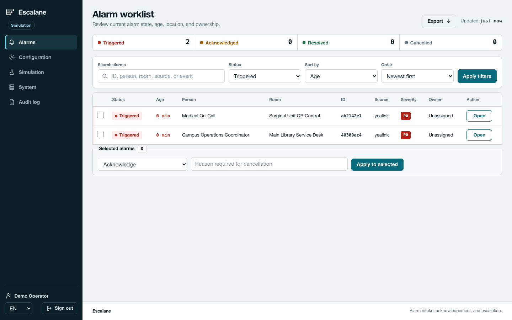
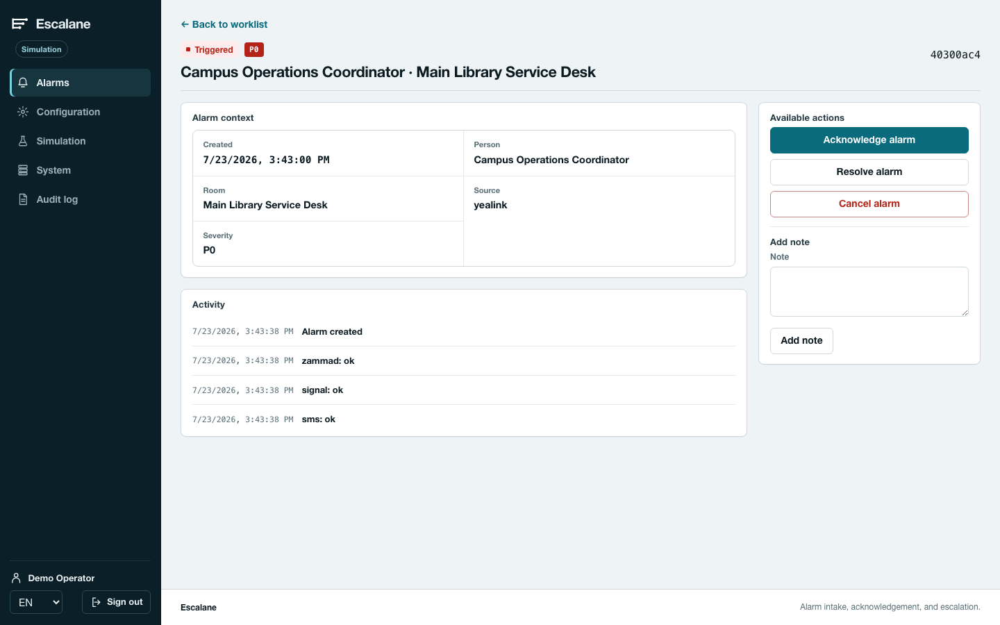
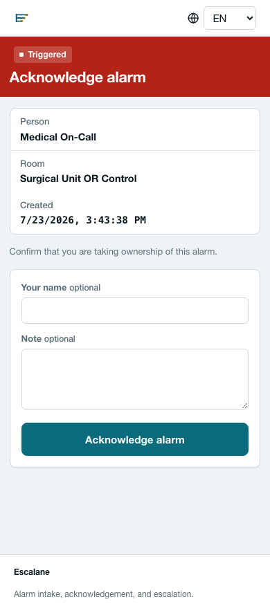
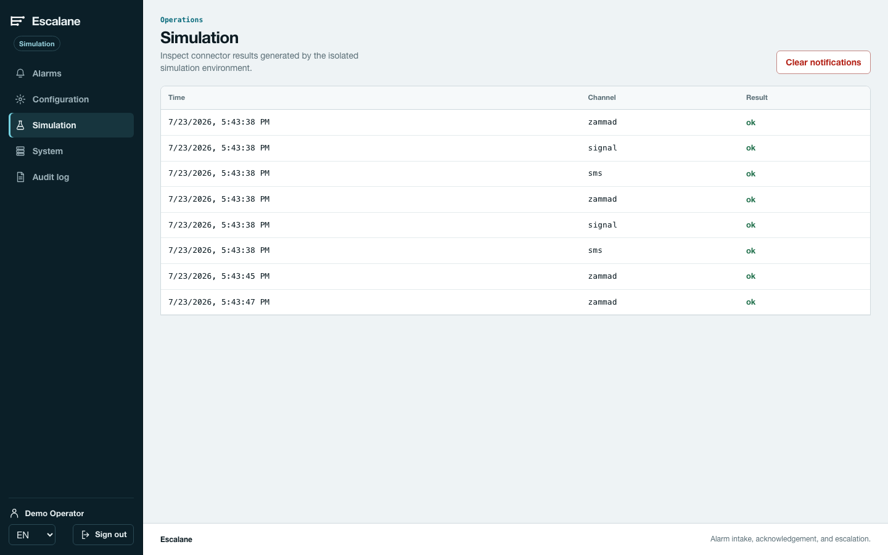

# Escalane

Escalane is a public-alpha alarm intake and escalation service. It accepts
device triggers, records alarm state in PostgreSQL, queues delivery work in
Redis, notifies configured destinations, and provides acknowledgement and
operator workflows.

The repository is a reference implementation. It has not been validated for
safety-critical, emergency-response, or compliance-critical use.

## Current capabilities

- Yealink-compatible HTTP trigger intake with device tokens, source CIDR
  allowlisting, and per-device rate limits
- PostgreSQL-backed alarm lifecycle: `triggered`, `acknowledged`, `resolved`,
  and `cancelled`
- Redis and ARQ workers for notification delivery, delayed escalation, and
  outbox recovery
- Zammad, SendXMS, Signal REST bridge, and allowlisted generic webhook
  connectors
- Capability-link acknowledgement page for responders
- Server-rendered operator console for alarms, notes, configuration, activity,
  health details, and simulation data
- Admin-key JSON API and optional OpenAPI documentation
- Docker Compose deployment with PostgreSQL, Redis, a one-shot Alembic
  migration, API, and worker services

## Current limitations

- The project is a public alpha and may change interfaces or operational
  behavior before a stable release.
- Delivery is at least once. A provider can receive a duplicate if delivery
  succeeds but the local audit write fails.
- Connector behavior depends on external systems and must be tested in the
  target environment.
- The included Compose file binds the API to loopback and does not provide TLS,
  a reverse proxy, backup scheduling, or external monitoring.
- Simulation mode uses local mock delivery and is not evidence of live
  connector behavior.
- The Python wheel is checked by CI but is not the documented deployment
  artifact. Tagged releases publish a container image.

## Requirements

For the Compose workflow:

- Docker with the Compose plugin
- `curl` for the verification examples

For local development:

- Python 3.14.x. CI uses Python 3.14.6.
- GNU Make
- PostgreSQL and Redis for integration and runtime checks
- Playwright browser binaries for browser E2E tests

## Quick start

Create the local environment file from the repository template and set the
required values:

```bash
cp .env.example .env
```

For the sample seed, configure `POSTGRES_PASSWORD`, `DATABASE_URL`,
`ADMIN_API_KEY`, `BASE_URL`, `YELK_IP_ALLOWLIST`, `YEALINK_DEVICE_TOKEN`,
`SIGNAL_TARGET_GROUP_ID`, `ESCALATE_T1`, `ESCALATE_T2`, and `ESCALATE_T3`.
Use `SIMULATION_ENABLED=true` with a loopback `BASE_URL` for a local mock
workflow. Compose reads the root `.env`; it does not export those values into
the interactive shell, so the HTTP examples use explicit placeholders.

Build and start the stack:

```bash
docker compose -f deploy/docker-compose.yml up -d --build
curl --fail http://127.0.0.1:8080/readyz
```

Load the sample configuration:

```bash
curl --fail \
  -H "X-Admin-Key: <admin-api-key>" \
  -H "Content-Type: application/yaml" \
  --data-binary @deploy/seed.example.yaml \
  http://127.0.0.1:8080/v1/admin/seed
```

Trigger the sample Yealink device:

```bash
curl --get --fail \
  --data-urlencode "token=<device-token>" \
  http://127.0.0.1:8080/v1/yealink/alarm
```

Open `http://127.0.0.1:8080/admin/login` and sign in with
`ADMIN_API_KEY`. See [Setup](docs/SETUP.md) for the complete configuration and
installation procedure.

## Browser interface

Explore the sanitized, command-safe
[static product demo](https://sebastianspicker.github.io/escalane/). It is a
small click-through of the operator and responder workflow; every
command-capable action is visibly marked as simulated and runs only in the
browser.

Build and inspect that same static artifact locally without starting
PostgreSQL, Redis, or the Escalane service:

```bash
./.venv/bin/python scripts/build_pages.py
./.venv/bin/python scripts/validate_pages.py build/pages
python3 -m http.server 8082 --bind 127.0.0.1 --directory build/pages
```

Open <http://127.0.0.1:8082/>. The Pages workflow repeats the build and
validation before publishing `build/pages`; the generated directory is local
output and is not committed. This walkthrough proves only the sanitized
in-browser fixture flow. It does not exercise the API, persistence, workers,
connectors, authentication, or a remote Pages deployment.









These images use the repository's Mock University fixtures. The capture and
review procedure is in
[docs/assets/screenshots/README.md](docs/assets/screenshots/README.md).

## Configuration

Configuration is read from environment variables and an optional `.env` file.
The authoritative variable list, defaults, validation rules, and connector
requirements are in [docs/SETUP.md](docs/SETUP.md). Source validation lives in
`services/escalane/escalane/settings.py`.

OpenAPI routes are disabled by default. Set `ENABLE_API_DOCS=true` to expose
`/docs`, `/redoc`, and `/openapi.json`.

## Usage

The principal HTTP surfaces are:

| Surface | Path | Access |
|---|---|---|
| Liveness | `/healthz` | Public |
| Readiness | `/readyz` | Public |
| Yealink trigger | `/v1/yealink/alarm` | Device token and source allowlist |
| Responder acknowledgement | `/a/{ack_token}` | Capability token |
| Operator sign-in | `/admin/login` | Admin key |
| Operator console | `/admin` | Session and CSRF protection |
| Alarm JSON API | `/v1/alarms` | `X-Admin-Key` |
| Admin JSON API | `/v1/admin` | `X-Admin-Key` |
| Metrics and health details | `/metrics`, `/healthz/details` | `X-Admin-Key` |
| Simulation API | `/v1/simulation` | `X-Admin-Key`, simulation mode only |

See [Integration notes](docs/INTEGRATIONS.md) for ingress and connector
contracts and [Operations](docs/OPERATIONS.md) for runtime procedures.

## Repository structure

```text
.
├── deploy/                    Compose definition and sample seed
├── docs/                      Architecture, setup, operations, and release guides
├── scripts/                   Validation, container smoke, and screenshot tools
├── services/escalane/
│   ├── alembic/               Database migrations
│   ├── escalane/              Application package
│   ├── tests/                 Unit, integration, security, repository, and E2E tests
│   └── pyproject.toml         Package and tool configuration
├── Dockerfile                 Runtime image
└── Makefile                   Development and validation commands
```

## Development and testing

```bash
make install
make lint
make test
make e2e
make hygiene-check
```

`make dev` installs development dependencies and runs the verbose test suite.
It does not start the API. See [Contributing](CONTRIBUTING.md) for the complete
workflow and [Frontend](docs/FRONTEND.md) for browser-specific checks.

## Deployment and operation

The checked-in Compose deployment runs PostgreSQL 16, Redis 7, the Alembic
migration, the API, and the ARQ worker. The three application services share
the image selected by `ESCALANE_IMAGE`.

Use [Setup](docs/SETUP.md) for installation and immutable-image deployment,
[Operations](docs/OPERATIONS.md) for health, backups, upgrades, and
troubleshooting, and [Releasing](docs/RELEASING.md) for the tag workflow.

## Security

Do not expose the service directly to an untrusted network. Terminate TLS at a
reverse proxy, restrict ingress, configure trusted proxy CIDRs, use random
credentials, and treat acknowledgement URLs as bearer capabilities. Review
[SECURITY.md](SECURITY.md) before deployment.

## Contributing and support

See [CONTRIBUTING.md](CONTRIBUTING.md) for development expectations,
[SUPPORT.md](SUPPORT.md) for issue routing, and
[CODE_OF_CONDUCT.md](CODE_OF_CONDUCT.md) for participation rules.

The project is licensed under the [MIT License](LICENSE).
